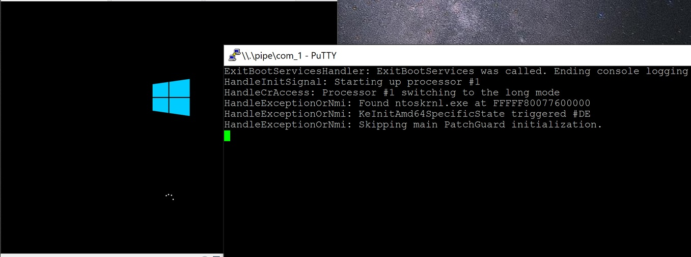
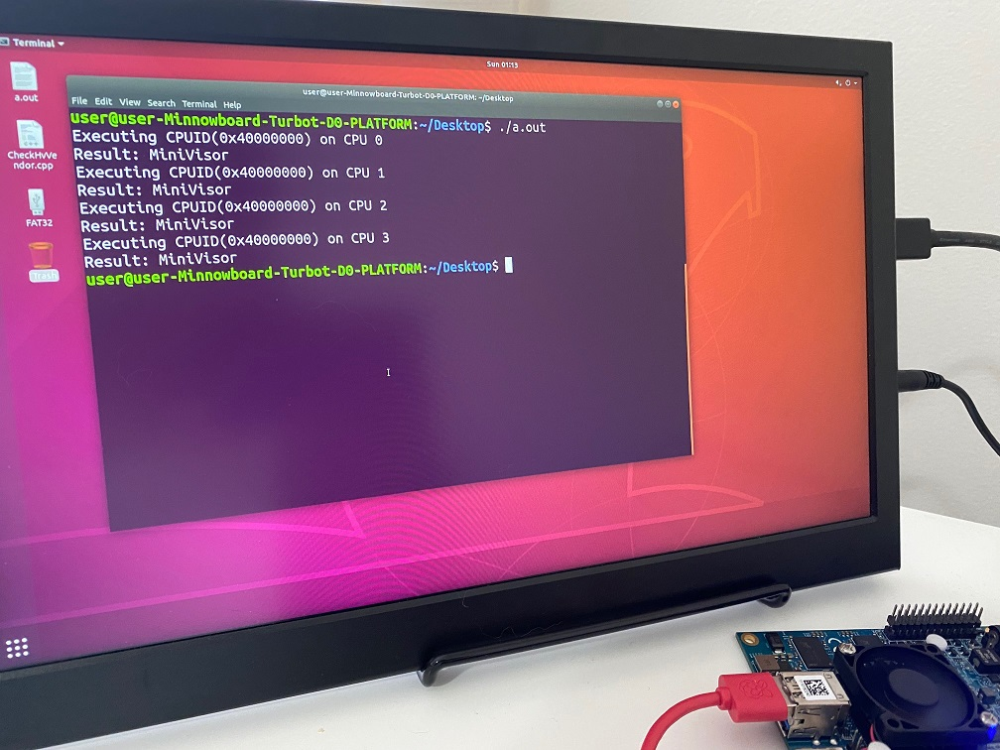

MiniVisor
==========

This is a research hypervisor written as a UEFI and Windows driver for the educational purpose for Intel processors.

This MiniVisor, as a UEFI driver, provides the ability to inspect system activities even before the operating system boots, while as a Windows driver, allows developers to debug it with familiar tools like WinDbg.

Showcase
---------

* Loading the hypervisor from the UEFI shell.
  

* Logging boot activities and interacting with the guest.
  

* Booting Ubuntu on a bare-metal.
  

Motivation
-----------

The goal of this project is to share an additional learning resource for writing UEFI hypervisors with the community and researchers.

There are numerous open source hypervisors with small and easy-to-study implementations, but those that support booting operating systems as UEFI drivers are still not many.

Given the universality of UEFI systems on the AMD64 ecosystem and the unique ability to monitor, attack and protect the system throughout operating system startup on bare-metal systems, the authors believe that having the understanding and being able to develop this type of hypervisors are valuable for research.

System Requirements
--------------------

Common Requirements:
* Intel VT-x and EPT supported processors

Requirements for the UEFI driver:
* UEFI-based system
* 64bit Windows 10, IoT Core, or Ubuntu to boot

Requirements for the Windows driver:
* 64bit Windows 7 and 10

See [Building and Debugging](Docs/Building_and_Debugging.md) for testing.

Advantages and Use Cases
-------------------------

While this project does not implement or designed for any immediately useful features, UEFI-based hypervisors have multiple advantages over Windows driver-based ones and can implement unique features.

* No need of disabling Hyper-V (Virtualization Based Security) to run the custom hypervisor
* No need of enabling the test-signing mode
* Zero direct indicator of existence of the hypervisor from operating system perspective
* Installing hooks during the early boot phase and letting PatchGuard to protect them
* Detecting bootkit and early system modification
* Implementing operating system agnostic solutions

Acknowledgments
----------------

The authors thank for creators and maintainers of the following projects:
* [Bareflank](https://github.com/Bareflank/hypervisor) and [STM](https://github.comjyao1/STM) -- for publishing UEFI-base hypervisors with the relatively small codebase.
* [zpp_hypervisor](https://github.com/eyalz800/zpp_hypervisor) -- for making me realize that writing UEFI-based hypervisors is viable.
* [EfiGuard](https://github.com/Mattiwatti/EfiGuard) -- for clean codebase and rich documentation for UEFI development newbies.
* [hvpp](https://github.com/wbenny/hvpp) -- for few techniques required for the UEFI environment.
* [ia32-doc](https://github.com/wbenny/ia32-doc) -- for saving me from defining thousands of constants and structures by hand.
